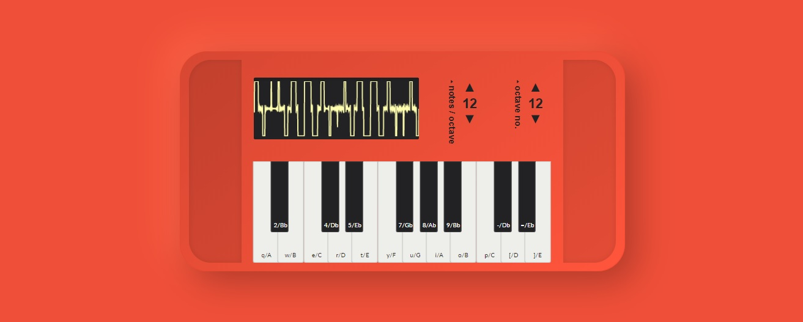

# Tunable keyboard 
Making a browser-based keyboard piano **but but but** you can tune the intervals between the keys. 

## In Detail 
A normal piano has 12 notes per octave. From middle C, these are arranged in a series of black an white keys in the form of C, C#/Db, D, D#/Eb, E, F, F#/Gb, G, G#/Ab, A, A#/Bb, B. In this system there are 12 (and often equal) devisions of the octave. 

That's cool, however, what if more notes? or fewer? the distance between any two adjacent keys (assuming the octave === 2 * frequency) can easily be calculated as 2^(1/x) where x is the number of divisions within the octave. 

## Features 
### Initial features for a standard piano keyboard:
- For the given user input of a starting pitch (note name), octave number (usually between 1-8), and number of keyboard keys, the app should generate a keyboard and map the keyboard piano keys to the users keyboard keys. 
- There should be a corresponding visual representation of the keyboard in the view that instructs the user on which key should be pressed to play each note ✅
- Pressing a key will correspond with a visual cue
- Each piano keys listen for keyboard events and play a tone on keydown ✅
- Pressing multiple keys will produce chords ✅

### Extended features
- For the given user defined number of notes per octave generate a custom keyboard 
- The user can optionally define note names if they want 

## Known Issues 
- Pressing two keys will sustain the first on key up 🤦‍♀ 
  - This is because of the way keyboard events work - i.e. one key is evaluated at a time

## Demo 
Sorry, no dem o at present, but here is a cool picture:
